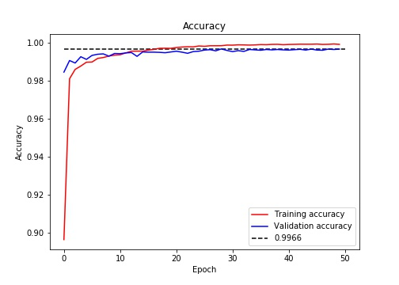
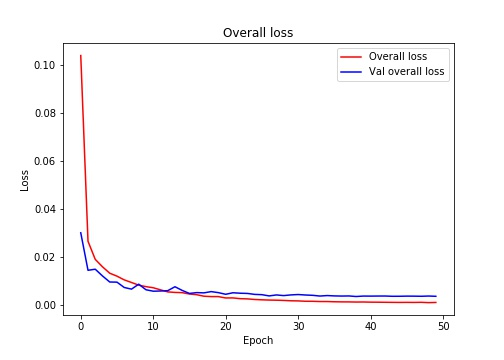
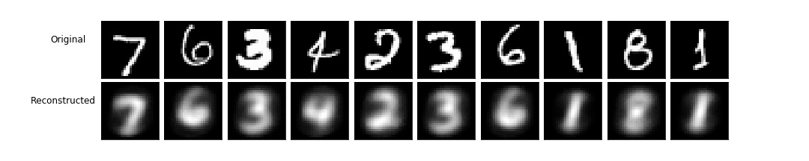

# Keras-Capsule-Networks

Keras implementation of [Sara Sabour, Nicholas Frosst, Geoffrey E Hinton. Dynamic Routing Between Capsules. NIPS 2017](https://arxiv.org/abs/1710.09829).

## Results

After training for 50 epochs with Adam (default parameters) and learning rate decay by factor of 0.9 after every epoch, the best test set error was 0.34%. 

The paper reported average test set error of 0.25%. Number of epochs and learning rate decay scheme were not specified in the paper.

#### Graphs:

#### Digits reconstructions using decoder network:

Reconstuctions are of poor quality, possibly due to not enough epochs of training.

### Training speed

Training on Google Colab (Tesla K80 GPU) took around 300s per epoch.

## Possible improvements and further work

* Investigate poor quality of digits reconstructions and improve them
* Once reconstructions are improved, visualize how changing capsule's dimensions affects reconstruction
* Add docstrings and more comments explaining what's happening in the code
* Test on other datasets (CIFAR10, smallNORB, MultiMNIST)

## References

Keras implementation by [Xifeng Guo](https://github.com/XifengGuo/CapsNet-Keras), especially the implementation of the masking layer.

